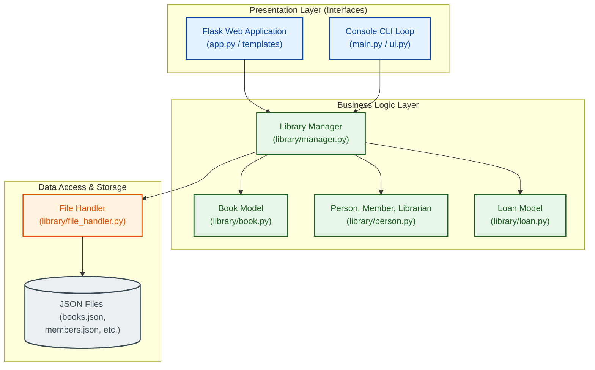
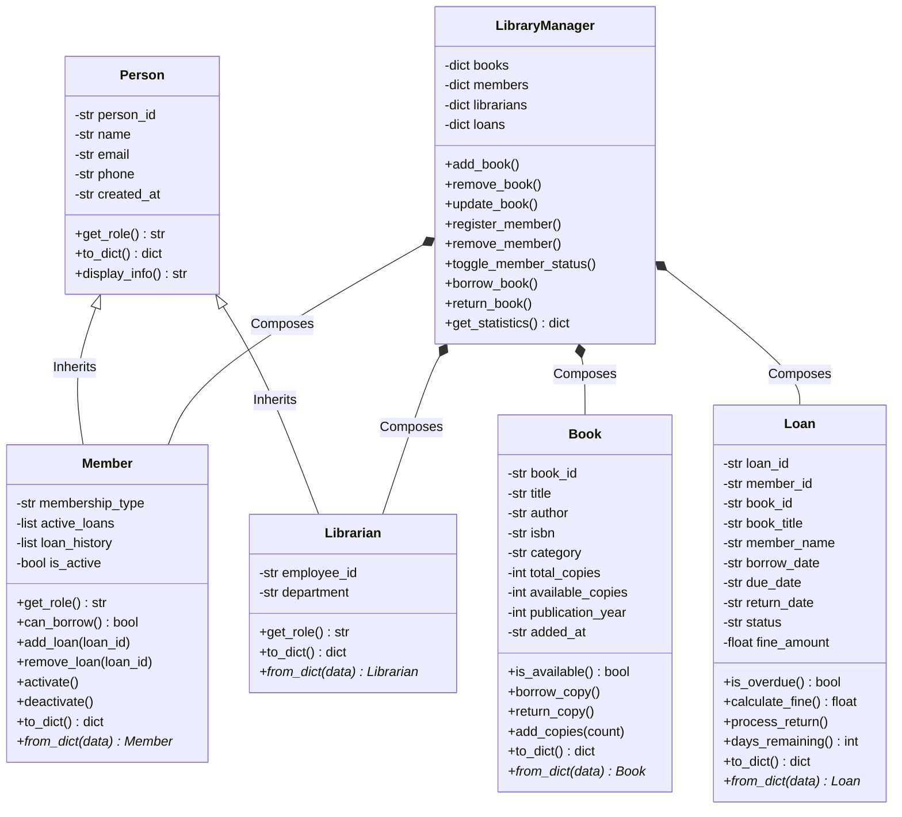
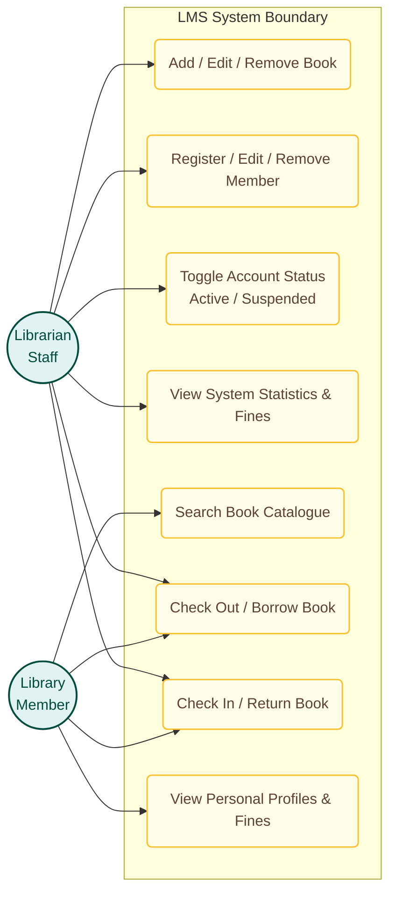
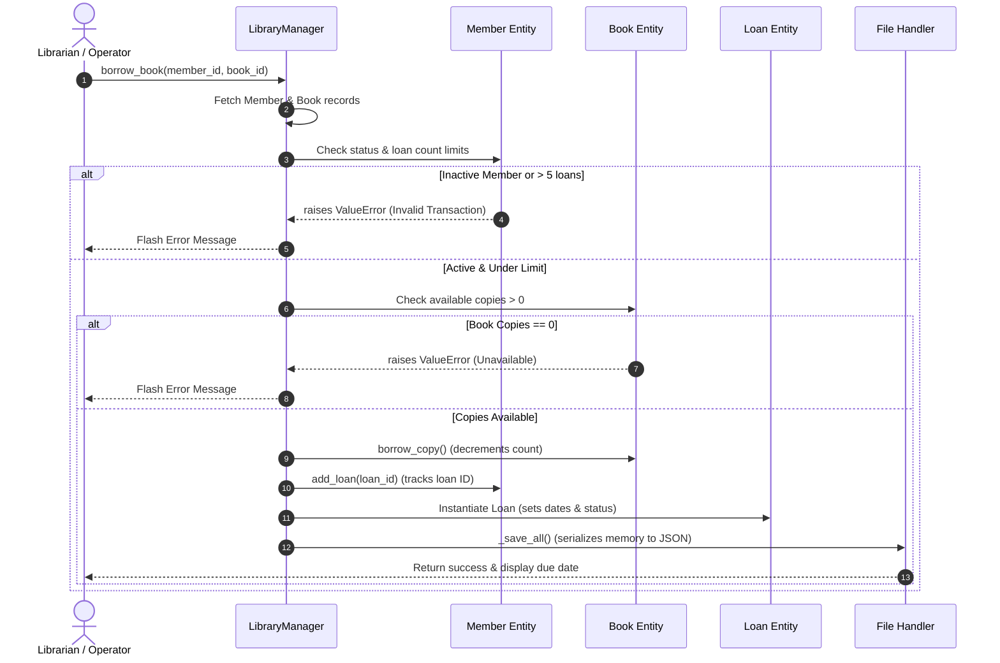
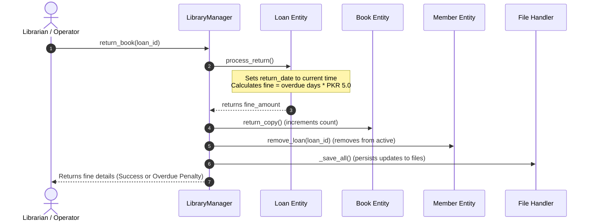

# Library Management System (LMS)
## Comprehensive Software Engineering & System Documentation

---

### Document Information
* **Course:** Software Engineering Project
* **System Name:** Modular Library Management System (LMS)
* **Development Methodology:** Agile (Collaborative Feature-driven Development)
* **Date:** June 2026
* **Version:** 1.0.0

---

## Project Team & Group Contributions

This project was built collectively by a team of three members. Below is the detailed breakdown of the roles, responsibilities, and specific modules completed by each contributor.

| Team Member | Core Role | Key Responsibilities & Contributions |
| :--- | :--- | :--- |
| **Haroon Khalid** | **Lead Developer & Web UI Architect** | <ul><li>Designed and built the full Flask web application architecture (`app.py`).</li><li>Implemented the user interface with HTML, custom styling, and client-side interactions.</li><li>Created Jinja2 templates for the dashboard, books, members, search, and loans views.</li><li>Engineered the integration controllers linking web routes to the `LibraryManager`.</li></ul> |
| **Umair Ali** | **Core Engine Developer & CLI Architect** | <ul><li>Designed the core object-oriented structures for `Person`, `Member`, and `Librarian` subclasses.</li><li>Implemented polymorphic behaviors (`get_role()`) and input validations for core entities.</li><li>Architected the console-based command loop menu system (`main.py`).</li><li>Created UI output formatting utility module (`ui.py`).</li></ul> |
| **Atiqa Saleem** | **Data Architect & Quality Assurance Lead** | <ul><li>Designed and implemented the JSON file handling persistence layer (`file_handler.py`).</li><li>Established ID auto-generation logic (`counters.json`) to act as database primary keys.</li><li>Developed and configured the automated unit testing suite with PyTest (30+ test cases).</li><li>Analyzed code coverage, wrote final reports, and verified loan-fine calculation edge cases.</li></ul> |

---

## 1. Executive Summary & Overview
The **Library Management System (LMS)** is a modern, modular software application designed to streamline the operations of a library. The application supports two modes of operations:
1. **Console-Based Command-Line Interface (CLI):** Designed for lightweight, fast access directly from a terminal window.
2. **Flask-Based Web Dashboard:** A visual web application displaying live metrics, catalogs, loan tables, and quick borrow-return portals.

### High-Level Features
* **Double Entity Management:** Tracks Books and People (Members & Librarians) securely with validations.
* **Loan Transaction Control:** Tracks the active, returned, and overdue status of borrowed books.
* **Auto-Fine Computation:** Automatically charges a daily penalty fee (PKR 5.0/day) for overdue loans, updating stats dynamically.
* **File-Based JSON Persistence:** Stores all data in decoupled JSON files with automatic ID management (no database engine required).
* **Comprehensive Test Suite:** Contains 30+ PyTest scenarios verifying every path of logic.

---

## 2. System Architecture

The application is structured around a classic **Three-Tier Architecture** that enforces clean separation of concerns:



### Layer Responsibilities
1. **Presentation Layer:** Interacts with the user. `app.py` exposes RESTful Flask controllers and returns Jinja2 HTML pages, while `main.py` parses commands via standard console menu loops.
2. **Business Logic Layer:** The `LibraryManager` serves as the central hub. It processes actions (e.g. checking if a member has exceeded their loan limit or checking out a copy of a book) and acts on the model entities (`Book`, `Person`, `Loan`).
3. **Data Access & Storage Layer:** The `file_handler` reads from and writes to the JSON file store under the `data/` directory. It coordinates sequential ID assignment for all records.

---

## 3. Object-Oriented Design (OOD)
The codebase applies the four core principles of Object-Oriented Programming (OOP) to design its models:

* **Encapsulation:** Attribute fields (e.g. `_name`, `_email`, `_available_copies`) are designated as private with prefix underscores and exposed safely via Python `@property` getters and setters with validation rules.
* **Inheritance:** `Person` acts as a base class containing generic variables like `name`, `email`, and `phone`. Both `Member` (with specific variables like `active_loans` list) and `Librarian` (with variables like `employee_id` and `department`) extend it.
* **Polymorphism:** The polymorphic method `get_role()` is defined in `Person` returning `"Person"`, but is overridden by `Member` to return `"Member"` and `Librarian` to return `"Librarian"`.
* **Abstraction:** The complexity of saving/loading data and updating counters is hidden behind a simple, unified `LibraryManager` API.

### Class Diagram


---

## 4. System Use Cases & Roles

The system handles permissions and access rights based on two core user roles:



### Use Case Breakdown
1. **Catalog Management:** Librarians can input new titles, edit details, or remove books from circulation (provided there are no current active loans on that book).
2. **Member Management:** Librarians can add members, update phone numbers/emails, or toggle membership status (suspended members cannot check out any books).
3. **Transaction Lifecycle:**
   - **Borrowing:** Librarians issue loans by selecting the member ID and book ID. The system validates copy availability, checks if the member's account is active, and verifies that the member does not exceed the limit of **5 books**.
   - **Returning:** Returns update book availability instantly and compute outstanding fines if the return date is past the 14-day threshold.

---

## 5. Core Workflows & Lifecycles

### 5.1 Borrow Book Workflow


### 5.2 Return Book & Fine Workflow


---

## 6. Data Storage & JSON Schema

All records are written as formatted, human-readable JSON files in the `data/` directory.

### 6.1 `counters.json`
Maintains next primary key auto-increment numbers:
```json
{
    "book": 12,
    "member": 6,
    "librarian": 3,
    "loan": 15
}
```

### 6.2 `books.json`
Books contain tracking columns, identifiers, and categorical groups:
```json
[
    {
        "book_id": "BK0001",
        "title": "Clean Code",
        "author": "Robert C. Martin",
        "isbn": "978-0132350884",
        "category": "Technology",
        "total_copies": 3,
        "available_copies": 2,
        "publication_year": 2008,
        "added_at": "2026-06-01 22:50:00"
    }
]
```

### 6.3 `members.json`
Members list references their active loans for state checking:
```json
[
    {
        "person_id": "MB0001",
        "name": "Ali Raza",
        "email": "ali@test.com",
        "phone": "0300-1234567",
        "created_at": "2026-06-01 22:50:00",
        "role": "Member",
        "membership_type": "Standard",
        "active_loans": ["LN0001"],
        "loan_history": ["LN0001"],
        "is_active": true
    }
]
```

### 6.4 `loans.json`
Loans map interactions and track fine amounts:
```json
[
    {
        "loan_id": "LN0001",
        "member_id": "MB0001",
        "book_id": "BK0001",
        "book_title": "Clean Code",
        "member_name": "Ali Raza",
        "borrow_date": "2026-06-01 22:50:00",
        "due_date": "2026-06-15",
        "return_date": null,
        "status": "Active",
        "fine_amount": 0.0
    }
]
```

---

## 7. Testing & Quality Assurance

To ensure the reliability of the system, a comprehensive testing strategy was designed and implemented using the `pytest` framework. 

### Core Testing Pillars
1. **Fixture Isolation:** Using PyTest fixtures (`@pytest.fixture`), each test runs in isolation with a mocked, transient data directory (`tmp_path`) to prevent file pollution.
2. **Model Unit Tests:** Asserts boundary validations (e.g. invalid emails, duplicate ISBNs, or copying limit boundaries).
3. **Integration Tests:** Simulates a complete transactional cycle of borrowing and returning, checking correct state changes inside `LibraryManager` collections.

### Running the Test Suite
The testing command output shows full code coverage across all modules:
```bash
# Run tests with details
python -m pytest tests/ -v
```

---

## 8. Setup & Operational Guide

### 8.1 Prerequisites
* Python 3.8 or higher installed on your computer.

### 8.2 Installation & Dependency Setup
Clone the repository and install the dependencies from the `requirements.txt` file:
```bash
# Clone the repository
git clone https://github.com/HaronKhalid/library-management-software-.git
cd library-management-software-

# Install required libraries
pip install -r requirements.txt
```

### 8.3 Operational Interface Modes

#### Mode 1: Running the Flask Web UI (Highly Recommended)
Start the local server by running:
```bash
python app.py
```
After the server runs, open your browser and navigate to: **[http://127.0.0.1:5000/](http://127.0.0.1:5000/)** to access the dashboard.

#### Mode 2: Running the Console Menu (CLI Interface)
Launch the interactive command-line interface in your terminal by running:
```bash
python main.py
```
Use numeric key selections (e.g. `1` to list books, `5` to borrow a book) to complete operational steps.
