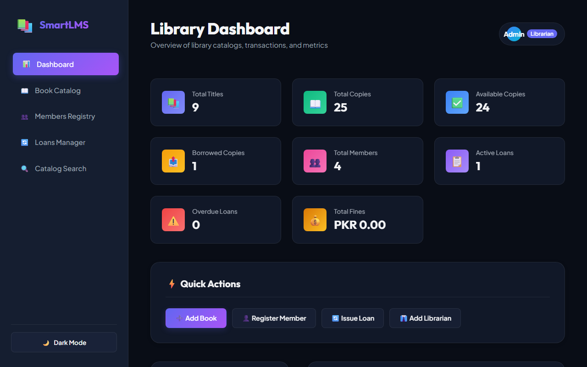
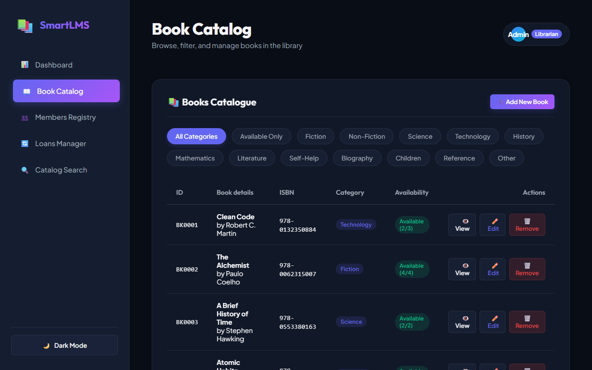
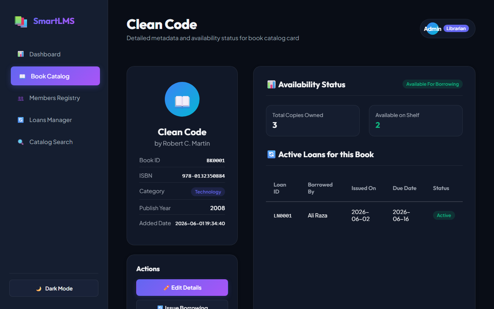
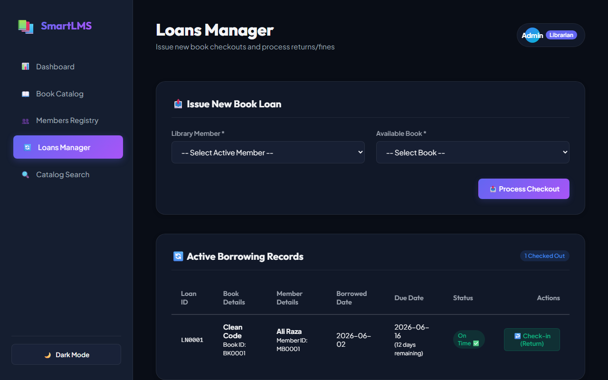
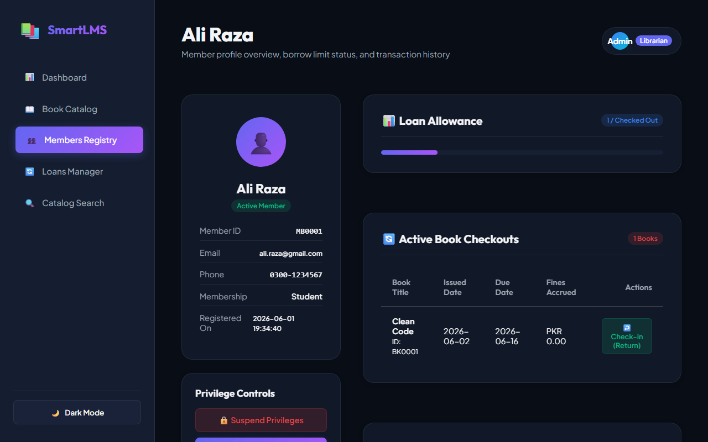
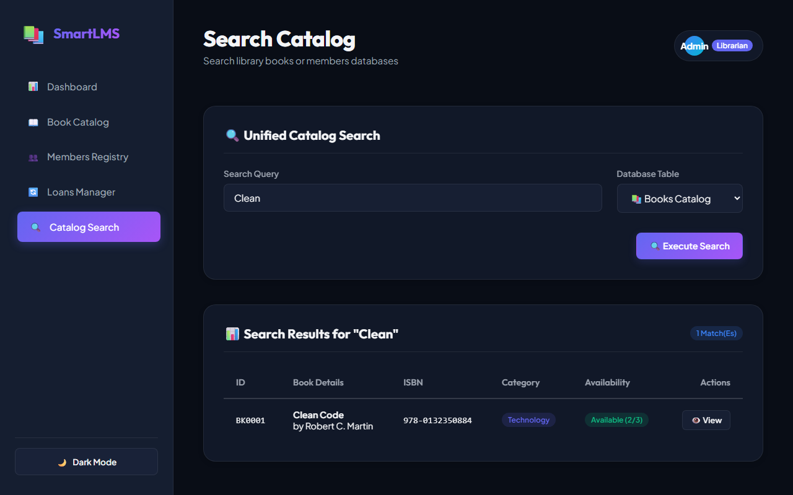
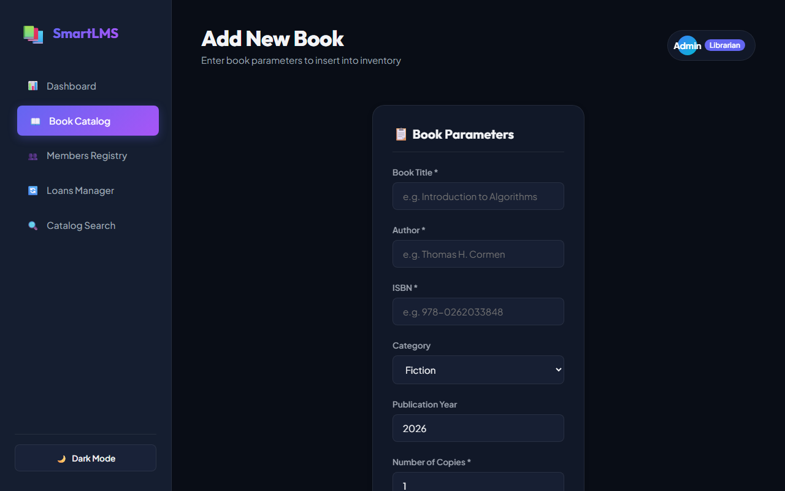
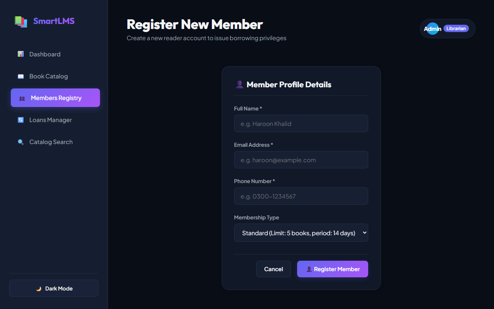
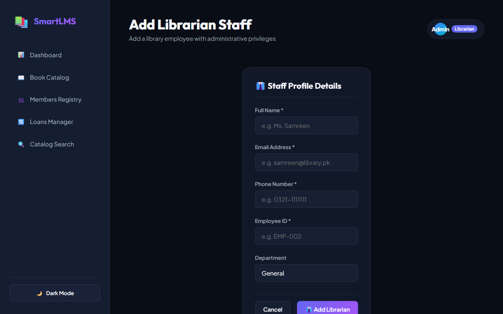

# Library Management System

[](https://www.python.org/)
[](LICENSE)
[]()

A fully modular, console-based Library Management System built with Python, demonstrating core software engineering principles including OOP, inheritance, file-based persistence, exception handling, and unit testing.

---

## Overview

This system manages the day-to-day operations of a library:
- Book catalogue management
- Member & librarian registration
- Borrow/return transactions with fine calculation
- Persistent JSON file storage
- Full search and filter functionality

---

## Features

| Feature | Description |
|---|---|
| Book Management | Add, remove, search, filter by category |
| Member Management | Register members, view profiles and loan history |
| Loan Management | Borrow/return books, track overdue loans |
| Fine Calculation | Automatic PKR 5/day fine for overdue returns |
| File Persistence | All data saved as JSON — no database needed |
| Search | Search books (title/author/ISBN) & members |
| Statistics | Live dashboard of library metrics |
| Unit Tests | 30+ tests with PyTest covering all modules |

---

## Project Structure

```
LibraryMS/
├── library/
│   ├── __init__.py         # Package init
│   ├── book.py             # Book entity class
│   ├── person.py           # Person (base), Member, Librarian (inheritance)
│   ├── loan.py             # Loan transaction class
│   ├── manager.py          # Core business logic manager
│   ├── file_handler.py     # JSON file persistence layer
│   └── ui.py               # Console UI helpers
├── data/                   # Auto-generated JSON data files
│   ├── books.json
│   ├── members.json
│   ├── librarians.json
│   ├── loans.json
│   └── counters.json
├── tests/
│   ├── __init__.py
│   └── test_library.py     # 30+ unit tests
├── main.py                 # Application entry point
├── requirements.txt
├── .gitignore
└── README.md
```

---

## Web UI Gallery

### Main Views
<table width="100%">
  <tr>
    <td width="50%" align="center">
      <b>Dashboard (Statistics & Overview)</b><br/>
      
    </td>
    <td width="50%" align="center">
      <b>Books Catalogue (List & Filters)</b><br/>
      
    </td>
  </tr>
  <tr>
    <td width="50%" align="center">
      <b>Book Details (Info & Active Loans)</b><br/>
      
    </td>
    <td width="50%" align="center">
      <b>Loans Management (Borrow & Active Loans)</b><br/>
      
    </td>
  </tr>
  <tr>
    <td width="50%" align="center">
      <b>Member Profile (Loans & History)</b><br/>
      
    </td>
    <td width="50%" align="center">
      <b>Unified Search (Filters & Query)</b><br/>
      
    </td>
  </tr>
</table>

### Forms & Input Fields
<table width="100%">
  <tr>
    <td width="33%" align="center">
      <b>Add Book Form</b><br/>
      
    </td>
    <td width="33%" align="center">
      <b>Register Member</b><br/>
      
    </td>
    <td width="33%" align="center">
      <b>Add Librarian</b><br/>
      
    </td>
  </tr>
</table>

---

## OOP Design

```
Person (Base Class)
├── Member    (Inheritance + Polymorphism)
└── Librarian (Inheritance + Polymorphism)

LibraryManager (Composition)
├── uses → Book
├── uses → Member / Librarian
└── uses → Loan
```

**OOP Principles Applied:**
- **Encapsulation** — All attributes are private (`_name`) with public properties
- **Inheritance** — `Member` and `Librarian` extend `Person`
- **Polymorphism** — `get_role()` overridden in each subclass
- **Abstraction** — `LibraryManager` hides complexity behind simple method calls

---

## Getting Started

### Prerequisites
- Python 3.8+

### Installation

```bash
# Clone the repository
git clone https://github.com/YOUR_USERNAME/LibraryMS.git
cd LibraryMS

# Install dependencies
pip install -r requirements.txt
```

### Running the Application

You can run the application in two modes:

#### 1. Web UI Interface (Recommended)
Build using Flask, providing a premium, interactive web dashboard:
```bash
python app.py
```
Then, open your web browser and navigate to: **[http://127.0.0.1:5000/](http://127.0.0.1:5000/)**

#### 2. Console-Based Menu (Original)
```bash
python main.py
```

### Running Tests

```bash
# Run all tests (including core models & Flask web endpoints)
python -m pytest tests/ -v

# Run with coverage report
python -m pytest tests/ -v --cov=library --cov-report=term-missing
```

---

## Data Storage

All data is stored as human-readable JSON files in the `data/` directory:

- `books.json` — Book catalogue
- `members.json` — Registered members
- `librarians.json` — Library staff
- `loans.json` — All borrow/return transactions
- `counters.json` — Auto-increment ID counters

Data persists between sessions automatically.

---

## Exception Handling

The system handles:
- Invalid inputs (empty fields, invalid email)
- Borrowing unavailable books
- Duplicate ISBN / email registration
- Removing members/books with active loans
- Corrupt or missing data files
- Empty search queries

---

## Statistics Dashboard

The statistics view provides:
- Total book titles and copies
- Available vs borrowed counts
- Total and active members
- Active and overdue loan counts
- Total outstanding fines

---

## Testing

Tests cover all major modules with 30+ test functions:

| Module | Tests |
|---|---|
| `book.py` | 11 tests |
| `person.py` | 9 tests |
| `loan.py` | 5 tests |
| `manager.py` | 15 tests |

---

## Group Members

| Name | Role |
|---|---|
| Umair Ali | Backend and the main program in python + basic idea |
| Haroon Khalid | Frontend Design and its development |
| Atiqa Saleem | Managing data and files, data handling and testing + final reports |

---

## Tech Stack

- **Language:** Python 3.8+
- **Storage:** JSON files
- **Testing:** PyTest
- **Version Control:** Git & GitHub

---

## License

This project is open-source under the MIT License.
